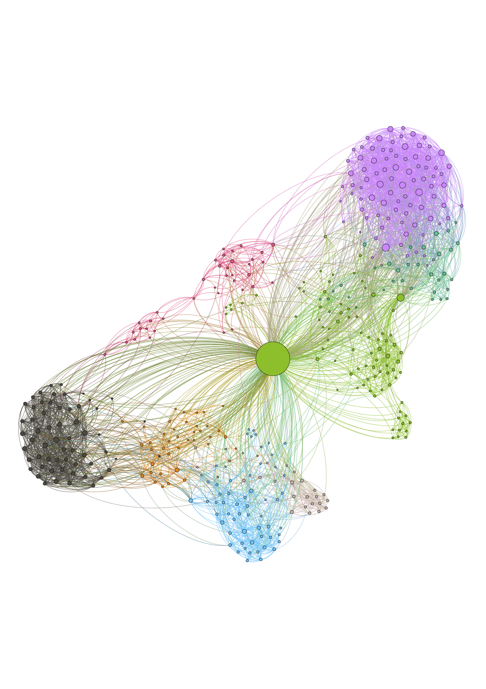

I have been ever more curious about life, human behavior biology and psychology, cognitive science, and sociology, etc. On New Year's Eve, an idea hit me -- I decided to learn more about myself using the immense amount of data I am allowing technology to collect on a daily basis. I was reading a book on network theory, so I decided to look at my own Facebook friend network.

Following this [blog](https://ndres.me/post/facebook-graph-network/), I made a plot of my Facebook friend network by scraping the mutual friends among all my FB friends. Since Facebook has removed the API to download my own FB data, the first step is to web-crawl. I used an automate web brower tool (`ChromeDriver`) for that. Mutual friends/connections between friendA and friendB are represented using an edge. So I end up having a list of edges for all my friends and mutual friends. Positions of the nodes are then computed using a force-directed algorithm, which simulates a physics-based transformation of the network such that connected nodes attract and disconnected ones repel (think of a spring). Finally, my friends are grouped into distinct communities (color-coded) using the Louvain Method.

Interestingly, my FB friend network looks like a "social butterfly"! It seems like I don't have an uneven distribution of friends with extremely dense inter-connetions, which is a good thing because of the importance of weak ties in our daily lives and also because it would imply that my Facebook feeds are likely going to be highly biased to the views of a certain group(s). An other interesting thing is that while I have moved from countries to countries and continents to continents, a small subset of my friends seem to share a similar path as me. E.g., we went to the same high school in Hong Kong, went to the same college in US; we went to the same college pursing the same major, and went to different graduate schools in the same field later, and so on.

It turns out that the average degree of my friend network is 9.5 (cf. the well-known median of 6.6). This means that every person in my friend network is connected to every other person with an average distance of 9.5 people (not as closely knitted than the rest of the world, 6.6). 

Before looking at the labels on the nodes, I also had a pretty good guess of what each community is (my FB friends are largely composed of 8 groups). I have delibrately removed the labels attached to the nodes before uploading this network graph for privacy reasons. That said, it is certainly clear that certain people have many connections to multiple communities in my friend group. It is unsurprisingly that they are also the people who have played some of the most important roles in my life.

