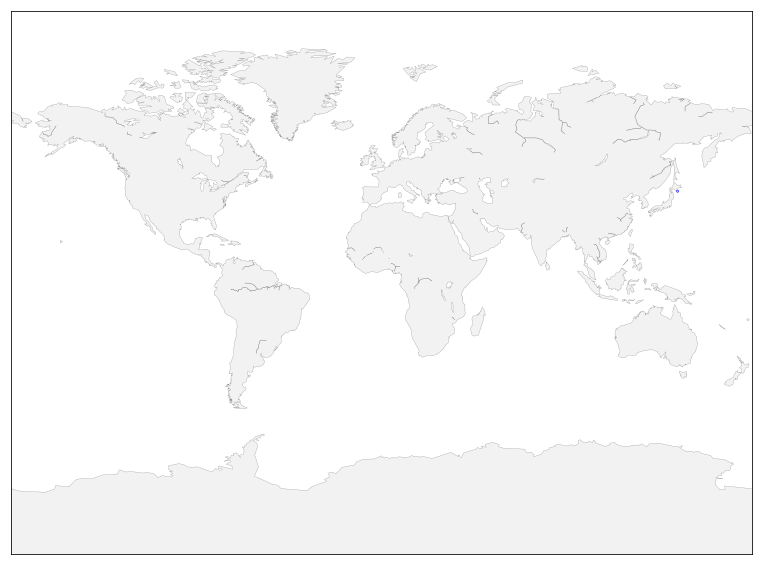

Visualizing earthquake events on earth projection map using matplotlib animation and basemap. 


## Use rain animation to visualize earthquakes 

Using data from USGS Earthquack Hazards Porgram. FOr now, include only the ones with magnitudes > 4.5.


```python
import urllib

#Hack to fix missing PROJ4 env var
import os
import conda

conda_file_dir = conda.__file__
conda_dir = conda_file_dir.split('lib')[0]
proj_lib = os.path.join(os.path.join(conda_dir, 'share'), 'proj')
os.environ["PROJ_LIB"] = proj_lib

from mpl_toolkits.basemap import Basemap
import matplotlib.pyplot as plt
import numpy as np
%matplotlib inline
```


```python
# -> http://earthquake.usgs.gov/earthquakes/feed/v1.0/csv.php
feed = "http://earthquake.usgs.gov/earthquakes/feed/v1.0/summary/"

# Significant earthquakes in the last 30 days
# url = urllib.request.urlopen(feed + "significant_month.csv")

# Magnitude > 4.5
url = urllib.urlopen(feed + "4.5_month.csv")

# Magnitude > 2.5
# url = urllib.request.urlopen(feed + "2.5_month.csv")

# Magnitude > 1.0
# url = urllib.request.urlopen(feed + "1.0_month.csv")

# Reading and storage of data
data = url.read()
print data[0:100]      # read in some header stuff
data = data.split(b'\n')[+1:-1]
E = np.zeros(len(data), dtype=[('position',  float, 2),
                               ('magnitude', float, 1)])

for i in range(len(data)):
    row = data[i].split(',')
    if i == 0:
        print row
    E['position'][i] = float(row[2]),float(row[1])
    E['magnitude'][i] = float(row[4])
    

```

    time,latitude,longitude,depth,mag,magType,nst,gap,dmin,rms,net,id,updated,place,type,horizontalError
    ['2019-02-07T07:57:55.580Z', '41.7599', '143.8067', '31.34', '4.9', 'mww', '', '130', '2.282', '1.17', 'us', 'us2000jen6', '2019-02-07T08:19:28.040Z', '"135km ESE of Shizunai', ' Japan"', 'earthquake', '8.2', '5.3', '0.075', '17', 'reviewed', 'us', 'us']


```python
E
```


    array([([ 143.8067   ,   41.7599   ], 4.9 ),
           ([ 126.4563   ,    1.5093   ], 5.7 ),
           ([ 160.9592   ,   -8.4642   ], 5.5 ),
           ([ 126.4991   ,    9.7927   ], 4.5 ),
           ([ -71.0784   ,  -19.9502   ], 4.5 ),
           ([ 117.5287   ,   -8.2526   ], 4.5 ),
           ([ -31.1176   ,    2.7336   ], 4.9 ),
           ([ -71.0967   ,  -19.9261   ], 5.3 ),
           ([ 146.0927   ,   21.4033   ], 5.3 ),
           ([ 128.8078   ,    2.2894   ], 5.  ),
           ([ 124.6199   ,   23.9588   ], 4.8 ),
           ([ 120.5481   ,   15.8487   ], 5.4 ),
           ([ 118.6143   ,   -3.0618   ], 4.8 ),
           ([-179.961    ,  -32.378    ], 4.7 ),
           ([ 128.4071   ,    2.5794   ], 5.  ),
           ([  48.6239   ,   40.9326   ], 5.1 ),
           ([ 106.8097   ,   -9.4544   ], 4.5 ),
           ([  48.5922   ,   40.9093   ], 4.6 ),
           ([ 131.8224   ,   30.9152   ], 4.9 ),
           ([  74.1708   ,   35.0728   ], 5.3 ),
           ([ -92.3374   ,   15.6676   ], 4.9 ),
           ([  30.1504   ,   36.5949   ], 4.5 ),
           ([  74.1173   ,   35.1137   ], 4.5 ),
           ([  70.8488   ,   36.5379   ], 4.6 ),
           ([ -78.576    ,   -2.81     ], 4.8 ),
           ([ 125.6708   ,    4.8485   ], 4.5 ),
           ([  20.5612   ,   39.0359   ], 5.4 ),
           ([ 141.0812   ,   33.5483   ], 4.7 ),
           ([  97.9707   ,   -0.4269   ], 4.5 ),
           ([ -28.2213   ,   44.6606   ], 4.9 ),
           ([  98.0101   ,   -0.4532   ], 5.6 ),
           ([ 150.9013   ,   45.5013   ], 4.5 ),
           ([ -79.8618   ,   -2.4476   ], 5.8 ),
           ([  21.125    ,   37.6646   ], 4.5 ),
           ([ 144.8236   ,   21.1823   ], 4.9 ),
           ([-177.8618   ,  -18.1644   ], 4.6 ),
           ([ -68.5523   ,   18.1358   ], 5.3 ),
           ([ 169.5971   ,  -21.1018   ], 4.9 ),
           ([-176.1588   ,  -24.6099   ], 5.3 ),
           ([ 100.6369   ,   -1.1155   ], 4.8 ),
           ([  73.9308   ,   38.4723   ], 4.5 ),
           ([ 152.649    ,   46.7608   ], 4.9 ),
           ([ 127.4441   ,    5.0636   ], 4.7 ),
           ([ 145.1239   ,   -3.3984   ], 4.7 ),
           ([-124.4741667,   40.2893333], 4.45),
           ([  93.9009   ,   24.5506   ], 4.5 ),
           ([ 141.7608   ,   -2.6934   ], 4.9 ),
           ([ 130.7504   ,   -3.2637   ], 5.4 ),
           ([ -23.8033   ,  -59.693    ], 4.6 ),
           ([-179.515    ,  -33.9379   ], 4.9 ),
           ([ 174.065    ,   52.128    ], 5.1 ),
           ([ -78.4422   ,   -2.6535   ], 5.  ),
           ([ -71.8755   ,  -31.3742   ], 4.8 ),
           ([ 141.2472   ,   37.0898   ], 4.8 ),
           ([-176.0097   ,  -15.5368   ], 4.5 ),
           ([  99.9795   ,   -2.9007   ], 4.7 ),
           ([ 141.1535   ,   35.5364   ], 4.9 ),
           ([ -88.2661   ,  -41.3388   ], 5.5 ),
           ([  99.9141   ,   -2.9318   ], 4.6 ),
           ([ 100.0898   ,   -2.9678   ], 5.1 ),
           ([  35.7881   ,   37.1508   ], 4.5 ),
           ([  70.6954   ,   36.4944   ], 5.6 ),
           ([ 100.3367   ,   -2.714    ], 5.9 ),
           ([ 100.0972   ,   -2.8943   ], 5.9 ),
           ([ -15.5073   ,   70.0308   ], 4.6 ),
           ([  99.9811   ,   -2.9151   ], 5.3 ),
           ([ 100.0208   ,   -2.8604   ], 6.1 ),
           ([ -15.9869   ,   70.0224   ], 4.9 ),
           ([ 100.0649   ,   -2.7675   ], 5.4 ),
           ([-174.8703   ,  -15.664    ], 5.4 ),
           ([ 126.9592   ,    1.2414   ], 4.6 ),
           ([ -68.5746   ,  -22.4332   ], 4.5 ),
           ([-173.5732   ,  -16.6475   ], 5.3 ),
           ([ 125.3601   ,    0.3944   ], 5.2 ),
           ([  21.416    ,   36.5077   ], 4.5 ),
           ([ 163.2216   ,   55.5465   ], 4.5 ),
           ([-176.8628   ,  -23.709    ], 5.3 ),
           ([ 104.9001   ,   -6.8831   ], 4.8 ),
           ([  83.3582   ,   46.8367   ], 5.3 ),
           ([ 100.0597   ,   -2.8933   ], 4.9 ),
           ([ -92.2981   ,   14.7628   ], 6.6 ),
           ([ -27.771    ,   45.6054   ], 4.9 ),
           ([ 144.3258   ,   21.4221   ], 5.  ),
           ([  27.3196   ,   35.7752   ], 4.9 ),
           ([ 144.4126   ,   21.4906   ], 5.2 ),
           ([ 113.1041   ,  -24.5094   ], 4.5 ),
           ([ 165.9063   ,  -12.955    ], 4.8 ),
           ([-105.0977   ,   -4.6385   ], 4.9 ),
           ([ 128.6768   ,    2.9301   ], 4.6 ),
           ([ 143.8848   ,   21.4209   ], 5.  ),
           ([-105.8054   ,   -5.1909   ], 4.7 ),
           ([ 143.6356   ,   21.5509   ], 5.1 ),
           ([  78.4109   ,  -33.6956   ], 4.9 ),
           ([-179.793    ,  -24.3041   ], 5.5 ),
           ([ -83.7578   ,    8.9782   ], 4.9 ),
           ([ 127.1638   ,    1.3677   ], 4.6 ),
           ([ -82.6542   ,    6.0589   ], 5.4 ),
           ([-177.9574   ,  -18.0584   ], 4.6 ),
           ([ 169.4743   ,  -19.5049   ], 5.4 ),
           ([ -88.3658   ,   13.4636   ], 5.2 ),
           ([ 164.7293   ,   54.89     ], 4.7 ),
           ([-178.2331   ,   51.4984   ], 4.7 ),
           ([-109.003    ,   23.9105   ], 5.3 ),
           ([ 143.0656   ,   23.7718   ], 4.7 ),
           ([  45.3267   ,  -12.8732   ], 4.7 ),
           ([-105.4442   ,   -4.6031   ], 5.9 ),
           ([ 120.6112   ,   21.8009   ], 4.9 ),
           ([ -87.7458   ,   12.3733   ], 4.5 ),
           ([ 119.5241   ,   -1.8207   ], 4.5 ),
           ([ 126.2571   ,    9.8289   ], 4.8 ),
           ([ -70.7335   ,  -25.9299   ], 5.6 ),
           ([-173.026    ,  -15.2011   ], 5.3 ),
           ([ 122.4458   ,   23.7056   ], 5.3 ),
           ([ 125.8227   ,   11.5746   ], 4.9 ),
           ([-175.4509   ,  -18.5852   ], 4.6 ),
           ([ 153.7169   ,   -5.8893   ], 4.9 ),
           ([ -93.8665   ,   17.4732   ], 5.4 ),
           ([ -30.9386   ,  -55.214    ], 4.9 ),
           ([-178.0266   ,  -20.8822   ], 4.6 ),
           ([ -72.4091   ,  -15.5061   ], 5.5 ),
           ([ -88.2787   ,   12.8557   ], 4.5 ),
           ([ 139.7164   ,   -3.0609   ], 5.  ),
           ([ 167.3406   ,  -14.9057   ], 4.9 ),
           ([ -91.6294   ,   13.6038   ], 4.5 ),
           ([ 125.864    ,    5.1054   ], 4.6 ),
           ([ 141.1344   ,   34.9184   ], 5.  ),
           ([ -94.9985   ,   16.6795   ], 5.  ),
           ([ -73.1832   ,  -15.6128   ], 4.5 ),
           ([ -75.6928   ,    3.0903   ], 5.5 ),
           ([  45.3679   ,  -12.7876   ], 4.6 ),
           ([-179.2578   ,  -17.9874   ], 5.5 ),
           ([ 139.3593   ,   -3.6714   ], 5.  ),
           ([ -72.9856   ,  -35.5845   ], 5.3 ),
           ([ 126.3672   ,    9.844    ], 4.9 ),
           ([-175.5313   ,  -14.6719   ], 4.8 ),
           ([ 128.5409   ,    2.3628   ], 4.6 ),
           ([  96.0937   ,   18.2723   ], 4.5 ),
           ([ 166.5712   ,  -13.3733   ], 4.9 ),
           ([-178.8014   ,  -21.3078   ], 4.5 ),
           ([ -67.3337   ,  -24.1555   ], 4.6 ),
           ([  94.0239   ,   24.4032   ], 4.7 ),
           ([ 146.3426   ,   -2.9321   ], 4.9 ),
           ([ 159.2341   ,   -9.2275   ], 4.8 ),
           ([ 145.6383   ,   16.3328   ], 4.5 ),
           ([ 125.2885   ,   24.2601   ], 4.9 ),
           ([-177.8044   ,  -20.1242   ], 5.8 ),
           ([ 125.8578   ,   11.5278   ], 5.1 ),
           ([-179.9418   ,  -23.5714   ], 4.7 ),
           ([-109.0715   ,   19.7062   ], 4.7 ),
           ([  94.2958   ,   24.8008   ], 4.7 ),
           ([  95.0427   ,    1.6822   ], 4.8 ),
           ([ 125.2386   ,   24.2963   ], 4.8 ),
           ([-129.8988   ,   44.5615   ], 4.5 ),
           ([-177.7998   ,  -18.1846   ], 4.9 ),
           ([ 143.9184   ,   65.1008   ], 4.5 ),
           ([ 169.2112   ,  -20.7887   ], 4.8 ),
           ([ 129.0224   ,   25.8315   ], 4.9 ),
           ([-178.9894   ,  -21.1607   ], 5.2 ),
           ([-178.8621   ,  -21.1404   ], 6.2 ),
           ([ 130.3179   ,   -6.5012   ], 5.2 ),
           ([  97.847    ,    1.8746   ], 4.9 ),
           ([ 130.4674   ,   29.2346   ], 4.9 ),
           ([  70.6696   ,   36.4246   ], 4.5 ),
           ([ -75.7693   ,    2.9902   ], 5.6 ),
           ([ -78.0826   ,    3.5912   ], 4.5 ),
           ([-179.7355   ,  -23.0796   ], 4.7 ),
           ([ 142.1958   ,   40.3435   ], 5.5 ),
           ([ 133.7649   ,   -5.4878   ], 5.8 ),
           ([ 130.5621   ,   33.0022   ], 4.5 ),
           ([ 156.2912   ,   -7.0161   ], 6.2 ),
           ([ 165.9495   ,  -10.8694   ], 5.7 ),
           ([ 131.1241   ,   30.3857   ], 4.8 ),
           ([ 126.6836   ,    2.1585   ], 4.9 ),
           ([-173.5836   ,  -15.4598   ], 5.  ),
           ([ 168.6445   ,  -19.1081   ], 5.  ),
           ([ -71.6274   ,  -15.2377   ], 4.8 ),
           ([  93.8896   ,   24.302    ], 4.6 ),
           ([ -77.4974   ,   -1.3676   ], 4.6 ),
           ([ -71.5353   ,  -30.1882   ], 4.5 ),
           ([ 129.1242   ,   32.021    ], 4.6 ),
           ([ 131.1498   ,   29.9919   ], 4.9 ),
           ([ -75.3858   ,  -14.5252   ], 5.6 ),
           ([-173.6951   ,  -15.6755   ], 4.9 ),
           ([-173.0738   ,  -16.0664   ], 4.9 ),
           ([ 147.0403   ,   -5.3615   ], 4.9 ),
           ([ 143.3464   ,   26.9503   ], 4.6 ),
           ([ 126.9596   ,    6.3139   ], 4.8 ),
           ([ 130.3423   ,   -6.2105   ], 4.5 ),
           ([ 148.0495   ,   -6.0506   ], 5.3 ),
           ([-178.7651   ,  -25.9018   ], 4.6 ),
           ([ -89.0811   ,   12.979    ], 4.6 ),
           ([ -74.6946   ,   -9.6066   ], 5.1 ),
           ([  28.1775   ,   36.0159   ], 5.3 ),
           ([ 128.1214   ,   26.9517   ], 4.7 ),
           ([-174.2263   ,  -22.5889   ], 5.2 ),
           ([ -71.2779   ,  -30.1058   ], 5.1 ),
           ([ 121.1488   ,   19.2442   ], 5.5 ),
           ([-179.9079   ,  -24.1946   ], 4.5 ),
           ([ -73.0312   ,    6.7272   ], 5.4 ),
           ([ 146.5694   ,   -2.9886   ], 4.9 ),
           ([-173.4036   ,  -15.1354   ], 5.5 ),
           ([-177.9713   ,  -30.4434   ], 5.2 ),
           ([ -38.0653   ,    8.0465   ], 5.2 ),
           ([ 119.0025   ,  -10.4139   ], 4.9 ),
           ([ 118.9288   ,  -10.3062   ], 5.5 ),
           ([ -67.2953   ,  -24.2631   ], 4.6 ),
           ([ 126.6551   ,    9.7073   ], 4.7 ),
           ([ -62.8703   ,   10.6583   ], 4.5 ),
           ([-177.953    ,  -33.5274   ], 5.1 ),
           ([-150.2373   ,   61.503    ], 4.5 ),
           ([  28.0046   ,   36.7649   ], 4.8 ),
           ([  42.3242   ,  -43.115    ], 6.7 ),
           ([ -71.5813   ,  -30.1362   ], 4.8 ),
           ([-177.9546   ,  -20.3726   ], 4.5 ),
           ([-175.8894   ,  -20.3248   ], 4.9 ),
           ([ -71.6299   ,  -30.2224   ], 4.8 ),
           ([-173.1403   ,  -15.1204   ], 4.8 ),
           ([-179.6911   ,  -24.0715   ], 4.6 ),
           ([ 128.7052   ,   -8.3026   ], 4.7 ),
           ([ 128.7177   ,   -8.343    ], 4.6 ),
           ([ -90.4597   ,    1.6786   ], 4.7 ),
           ([ -29.245    ,   41.4297   ], 4.9 ),
           ([ 119.0309   ,  -10.4663   ], 6.4 ),
           ([-155.3231   ,   58.3317   ], 5.2 ),
           ([ 121.4315   ,   22.209    ], 4.9 ),
           ([ 119.0651   ,  -10.4432   ], 4.8 ),
           ([ 118.9293   ,  -10.3487   ], 4.6 ),
           ([ -71.4701   ,  -30.0953   ], 4.6 ),
           ([ 119.1059   ,  -10.3438   ], 5.  ),
           ([ 119.1472   ,  -10.3113   ], 6.  ),
           ([ -70.3391   ,  -33.9078   ], 4.8 ),
           ([ -72.2515   ,  -31.7883   ], 4.7 ),
           ([ 126.9129   ,    4.4894   ], 5.1 ),
           ([-112.1568   ,  -13.1477   ], 4.6 ),
           ([-174.614    ,  -18.6608   ], 4.6 ),
           ([ -61.6503   ,   15.764    ], 4.5 ),
           ([ -79.12     ,    2.6434   ], 4.6 ),
           ([ 127.4209   ,    2.9417   ], 4.5 ),
           ([ -94.7274   ,   15.5693   ], 5.8 ),
           ([ 141.8786   ,   29.0196   ], 4.7 ),
           ([  69.2087   ,  -22.8388   ], 5.3 ),
           ([ -41.4464   ,   30.9902   ], 4.9 ),
           ([ 176.278    ,   51.6086   ], 4.7 ),
           ([ 169.1985   ,  -21.9331   ], 5.7 ),
           ([ 169.0153   ,  -21.8955   ], 5.5 ),
           ([-174.6194   ,  -20.6496   ], 4.8 ),
           ([ 138.7675   ,   11.       ], 4.7 ),
           ([  28.2908   ,   35.6133   ], 5.  ),
           ([  87.6754   ,   30.3859   ], 4.7 ),
           ([  87.6229   ,   30.3908   ], 5.2 ),
           ([ -81.0055   ,   13.0739   ], 4.5 ),
           ([ 146.2309   ,   -2.9841   ], 4.5 ),
           ([  45.4151   ,  -12.8299   ], 4.8 ),
           ([ 145.364    ,   14.117    ], 4.6 ),
           ([ -72.0335   ,  -29.8743   ], 4.5 ),
           ([ 121.624    ,    5.6508   ], 4.9 ),
           ([ 168.7904   ,  -19.2102   ], 4.7 ),
           ([  95.0511   ,   30.0066   ], 4.6 ),
           ([ -71.4234   ,  -30.0738   ], 6.7 ),
           ([-173.3961   ,  -64.901    ], 4.8 ),
           ([ 142.1615   ,   -5.6464   ], 5.1 ),
           ([ 144.173    ,   12.4217   ], 5.  ),
           ([ 126.6932   ,    2.2739   ], 5.1 ),
           ([ 128.8495   ,    3.5151   ], 4.6 ),
           ([ -66.1955   ,  -22.5519   ], 4.6 ),
           ([ 169.4924   ,  -22.1888   ], 4.7 ),
           ([ 125.9343   ,   12.7222   ], 4.6 ),
           ([-178.5573   ,  -28.7072   ], 4.8 ),
           ([-103.325    ,    8.3206   ], 4.6 ),
           ([ -76.8512   ,   -3.3044   ], 5.7 ),
           ([ 142.4008   ,   40.7964   ], 4.9 ),
           ([ 128.6607   ,    3.3133   ], 5.1 ),
           ([ 145.8958   ,   -5.4127   ], 4.9 ),
           ([-103.286    ,    8.2171   ], 4.8 ),
           ([ 167.9563   ,  -14.4673   ], 4.6 ),
           ([ 177.5993   ,  -37.7198   ], 4.6 ),
           ([-103.466    ,    8.2699   ], 6.  ),
           ([ 128.6781   ,    3.3236   ], 4.8 ),
           ([ -71.5698   ,  -30.7457   ], 4.5 ),
           ([ 168.6329   ,  -19.2079   ], 6.  ),
           ([ 140.5419   ,   35.885    ], 5.  ),
           ([  56.6649   ,   14.2194   ], 4.5 ),
           ([  73.0968   ,   39.4515   ], 4.5 ),
           ([ 128.8751   ,    3.4907   ], 4.6 ),
           ([-179.7515   ,  -23.42     ], 4.7 ),
           ([  12.6438   ,  -52.5002   ], 5.3 ),
           ([ 146.6848   ,   -3.2162   ], 4.6 ),
           ([ 146.5273   ,   -3.0059   ], 4.8 ),
           ([ 146.5766   ,   -3.1237   ], 4.6 ),
           ([ 146.4872   ,   -3.2129   ], 5.7 ),
           ([ 146.4441   ,   -3.0945   ], 4.6 ),
           ([ 146.593    ,   -3.1482   ], 4.5 ),
           ([ 146.4442   ,   -3.0649   ], 5.1 ),
           ([ 146.5611   ,   -3.2566   ], 4.6 ),
           ([ 146.4315   ,   -3.1029   ], 4.9 ),
           ([ 146.5879   ,   -3.3713   ], 4.8 ),
           ([ 126.0547   ,    4.0359   ], 4.9 ),
           ([ 146.356    ,   -3.1497   ], 5.1 ),
           ([ 146.5888   ,   -3.1026   ], 5.  ),
           ([ 153.5739   ,   45.7734   ], 4.6 ),
           ([ 146.3564   ,   -3.2525   ], 6.2 ),
           ([-178.3941   ,  -18.2309   ], 4.5 ),
           ([  81.606    ,   41.7744   ], 4.7 ),
           ([-114.0388   ,   29.6405   ], 5.3 ),
           ([ 123.2775   ,   17.9668   ], 4.7 ),
           ([  67.9813   ,   -4.4052   ], 5.1 ),
           ([  22.1476   ,   36.5132   ], 4.5 ),
           ([ 167.3219   ,  -14.3522   ], 5.2 ),
           ([  94.3901   ,    7.4131   ], 5.4 ),
           ([ 142.689    ,   41.9433   ], 4.8 ),
           ([   5.5829   ,   72.3782   ], 4.6 ),
           ([  96.3344   ,   24.8046   ], 4.7 ),
           ([ 146.4241   ,   -3.1501   ], 4.5 ),
           ([ 128.668    ,    3.5635   ], 5.1 ),
           ([ 128.6501   ,    3.4679   ], 5.4 ),
           ([ -16.0281   ,  -43.8741   ], 5.1 ),
           ([-173.3192   ,  -15.1353   ], 5.  ),
           ([ 168.9572   ,  -21.6496   ], 5.4 ),
           ([ 169.4063   ,  -22.0616   ], 5.1 ),
           ([ 129.0073   ,   -4.0277   ], 4.6 ),
           ([ -68.2711   ,   19.4966   ], 4.5 ),
           ([ -98.3607   ,  -36.0844   ], 4.6 ),
           ([ 129.0075   ,   -7.0491   ], 4.9 ),
           ([ -73.0097   ,   37.2318   ], 4.6 ),
           ([ 141.6031   ,   28.9996   ], 4.5 ),
           ([ -79.0533   ,   -8.9422   ], 5.2 ),
           ([ 126.8965   ,    5.8207   ], 5.8 ),
           ([-178.5695   ,  -17.885    ], 4.5 ),
           ([ 166.8787   ,  -13.3312   ], 6.6 ),
           ([ 146.597    ,   -3.2362   ], 4.8 ),
           ([ 104.9626   ,   28.1278   ], 4.5 ),
           ([ 169.8081   ,  -22.1338   ], 4.7 ),
           ([ 141.2357   ,   33.7059   ], 4.7 ),
           ([ -63.0971   ,   10.5357   ], 4.5 ),
           ([ 168.9798   ,  -22.0406   ], 4.7 ),
           ([ -63.0834   ,   10.4803   ], 4.9 ),
           ([ -86.6207   ,   11.2853   ], 5.3 ),
           ([ -87.606    ,   12.5262   ], 4.5 ),
           ([ 146.6097   ,   -5.9772   ], 4.9 ),
           ([  56.0714   ,   14.7334   ], 4.6 ),
           ([  20.5913   ,   38.949    ], 4.5 ),
           ([ 130.2355   ,   -5.6967   ], 4.7 ),
           ([  99.0705   ,    1.7028   ], 4.9 ),
           ([ -70.6526   ,  -17.6744   ], 5.2 ),
           ([-176.817    ,   51.7247   ], 4.5 ),
           ([  77.2387   ,   40.2694   ], 4.6 ),
           ([ 101.7416   ,   21.3373   ], 4.6 ),
           ([-170.2982   ,   52.6541   ], 4.5 ),
           ([  64.4699   ,   23.8879   ], 4.7 ),
           ([ 164.4618   ,   55.3798   ], 4.6 ),
           ([ 139.8748   ,   36.1902   ], 5.  ),
           ([ 128.5568   ,    3.4788   ], 4.5 ),
           ([ 126.3971   ,    1.6012   ], 4.6 ),
           ([ 169.9595   ,  -22.5773   ], 4.5 ),
           ([ 166.7056   ,  -12.0971   ], 4.9 ),
           ([-145.0273   ,   69.624    ], 4.9 ),
           ([-174.2464   ,  -22.7022   ], 5.  ),
           ([ 126.4369   ,    0.6294   ], 4.7 ),
           ([-150.0647   ,   61.2993   ], 5.  ),
           ([-173.3228   ,  -20.6909   ], 4.5 ),
           ([ 151.1737   ,   -6.1491   ], 4.6 ),
           ([ 161.3925   ,  -10.0806   ], 5.3 ),
           ([ 126.8711   ,    2.3985   ], 4.6 ),
           ([ 141.3578   ,   37.282    ], 4.8 ),
           ([ -25.5479   ,  -59.0905   ], 4.6 ),
           ([ 141.1882   ,   37.3188   ], 4.5 ),
           ([ 138.8115   ,   30.0749   ], 4.5 ),
           ([ 148.95     ,   50.4623   ], 4.5 ),
           ([ 128.7606   ,    3.6653   ], 4.6 ),
           ([ 128.7477   ,    3.6734   ], 5.  ),
           ([ 128.638    ,    3.6259   ], 5.1 ),
           ([-177.354    ,  -27.2531   ], 4.9 ),
           ([ 129.2095   ,   -7.2344   ], 5.  ),
           ([  20.4045   ,   37.4866   ], 4.5 ),
           ([ 151.3607   ,   -5.4307   ], 4.6 ),
           ([  67.8958   ,   -8.827    ], 4.6 ),
           ([ 152.134    ,   -5.7533   ], 5.2 ),
           ([ 152.2203   ,   -5.8483   ], 5.3 ),
           ([-177.4169   ,  -19.1338   ], 4.7 ),
           ([ 119.7573   ,   -8.4913   ], 4.6 ),
           ([ 120.7013   ,   18.1383   ], 4.7 ),
           ([ 127.4827   ,   -7.5917   ], 4.7 ),
           ([ 104.2141   ,   -6.8198   ], 5.1 ),
           ([ 159.2971   ,   53.1001   ], 5.  ),
           ([-175.8795   ,  -26.6648   ], 4.9 ),
           ([-177.9233   ,  -18.0553   ], 4.9 ),
           ([-175.8987   ,  -26.7722   ], 4.7 ),
           ([ 131.3873   ,   -5.5282   ], 4.6 ),
           ([-175.8455   ,  -26.8175   ], 5.2 ),
           ([-176.193    ,  -26.6602   ], 4.5 ),
           ([  75.7001   ,   39.6371   ], 5.3 ),
           ([ 118.7758   ,   -8.0637   ], 4.6 ),
           ([ 169.5613   ,  -19.0067   ], 4.6 ),
           ([ -27.1924   ,  -60.1324   ], 4.5 ),
           ([ -78.0484   ,   -1.6756   ], 4.6 ),
           ([ 168.7341   ,  -21.66     ], 4.8 ),
           ([ 164.6495   ,   55.0239   ], 4.6 ),
           ([ 126.7472   ,    2.2143   ], 4.5 ),
           ([ 101.2768   ,   -3.3931   ], 5.4 ),
           ([-178.1768   ,  -18.1651   ], 4.7 ),
           ([ 127.26     ,    2.7205   ], 4.8 ),
           ([-173.9918   ,  -21.4119   ], 5.2 ),
           ([ 126.8657   ,    2.3299   ], 4.5 ),
           ([-176.1522   ,  -26.9635   ], 4.9 ),
           ([-149.8991   ,   61.4708   ], 4.6 ),
           ([-174.5559   ,  -21.8067   ], 4.7 ),
           ([-176.106    ,  -26.7842   ], 4.9 ),
           ([-176.0543   ,  -27.0705   ], 4.9 ),
           ([-176.177    ,  -27.0296   ], 4.8 ),
           ([-175.8286   ,  -23.904    ], 4.9 ),
           ([-176.1001   ,  -26.9036   ], 4.8 ),
           ([-176.3444   ,  -27.0668   ], 4.9 ),
           ([  26.6262   ,   34.5801   ], 5.  ),
           ([ 167.1508   ,  -17.1478   ], 4.8 ),
           ([-176.3356   ,  -26.9697   ], 5.1 ),
           ([  20.6178   ,   37.3192   ], 4.8 ),
           ([-176.1577   ,  -27.1754   ], 5.  ),
           ([-175.5446   ,  -26.904    ], 5.8 ),
           ([ 168.8008   ,  -21.7231   ], 5.1 ),
           ([-176.4044   ,  -16.2769   ], 4.7 ),
           ([ 158.9296   ,   53.7856   ], 4.6 ),
           ([ -66.7125   ,  -23.6109   ], 4.5 ),
           ([-176.29     ,  -29.9315   ], 5.2 ),
           ([  78.2183   ,   34.393    ], 4.6 ),
           ([ -94.956    ,   15.7846   ], 4.5 ),
           ([ 126.569    ,    5.6988   ], 4.6 ),
           ([  80.3063   ,  -32.6198   ], 4.7 ),
           ([ 119.9551   ,   -9.3853   ], 5.  ),
           ([ 147.9241   ,   -4.6314   ], 4.7 ),
           ([-177.8844   ,  -17.9428   ], 4.6 ),
           ([ 147.9213   ,   -4.5484   ], 4.9 ),
           ([  45.5606   ,  -12.91     ], 4.9 ),
           ([-177.7632   ,  -20.2937   ], 4.7 ),
           ([-177.6219   ,  -30.972    ], 4.6 ),
           ([  95.8814   ,    3.9106   ], 5.1 ),
           ([-174.2995   ,  -17.4266   ], 4.9 ),
           ([  45.4527   ,  -12.8001   ], 4.7 ),
           ([-144.6726   ,   69.1016   ], 4.5 ),
           ([ 140.9518   ,   28.26     ], 4.7 ),
           ([ -25.5839   ,  -56.4354   ], 4.5 ),
           ([ 144.0206   ,   12.2861   ], 4.7 ),
           ([-178.5333   ,  -31.7415   ], 4.5 ),
           ([ 143.868    ,   12.031    ], 4.7 ),
           ([-174.6083   ,  -18.087    ], 4.9 ),
           ([  72.5644   ,   39.4328   ], 4.5 ),
           ([ 142.448    ,   28.9962   ], 4.5 ),
           ([ 169.8067   ,  -19.4492   ], 4.6 ),
           ([ 130.6604   ,   -8.066    ], 4.7 ),
           ([-174.2895   ,  -17.6716   ], 5.2 ),
           ([ 121.041    ,   19.0656   ], 4.6 ),
           ([-174.7662   ,  -17.5406   ], 4.6 ),
           ([ 131.0371   ,   30.5926   ], 6.3 ),
           ([ 121.6187   ,   23.19     ], 4.9 ),
           ([ 108.515    ,  -10.5278   ], 4.7 ),
           ([ -73.9994   ,   -4.6448   ], 5.1 ),
           ([ 106.5252   ,   -7.7501   ], 5.2 )],
          dtype=[('position', '<f8', (2,)), ('magnitude', '<f8')])


Draw earth on a figure to show precisely where the earthquake center is.
First step is to define a projection to draw the earth onto a screen (there exists many different projections) and we'll stick to the mill projection which is rather standard.


```python
fig = plt.figure(figsize=(14,10))
ax = plt.subplot(1,1,1)

earth = Basemap(projection='mill')
earth.drawcoastlines(color='0.50', linewidth=0.25)
earth.fillcontinents(color='0.95')

P = np.zeros(50, dtype=[('position', float, 2),
                         ('size',     float, 1),
                         ('growth',   float, 1),
                         ('color',    float, 4)])
scat = ax.scatter(P['position'][:,0], P['position'][:,1], P['size'], lw=0.5,
                  edgecolors = P['color'], facecolors='None', zorder=10)

def update(frame):
    current = frame % len(E)
    i = frame % len(P)

    P['color'][:,3] = np.maximum(0, P['color'][:,3] - 1.0/len(P))
    P['size'] += P['growth']

    magnitude = E['magnitude'][current]
    P['position'][i] = earth(*E['position'][current])
    P['size'][i] = 5
    P['growth'][i]= np.exp(magnitude) * 0.1
    
    # print P

    if magnitude < 6:
        P['color'][i]    = 0,0,1,1
    else:
        P['color'][i]    = 1,0,0,1
    scat.set_edgecolors(P['color'])
    scat.set_facecolors(P['color']*(1,1,1,0.25))
    scat.set_sizes(P['size'])
    scat.set_offsets(P['position'])
    return scat,


from matplotlib.animation import FuncAnimation
# animation = FuncAnimation(fig, update, interval=10)
animation = FuncAnimation(fig, update, interval=10, blit=True, frames=200)
plt.show();


```





```python
%%capture
plt.rcParams["animation.html"] = "jshtml"
# New figure with white background
fig = plt.figure(figsize=(6,6), facecolor='white')

# New axis over the whole figure, no frame and a 1:1 aspect ratio
ax = fig.add_axes([0,0,1,1], frameon=False, aspect=1)

# Number of ring
n = 50
size_min = 50
size_max = 50*50

# Ring position
P = np.random.uniform(0,1,(n,2))

# Ring colors
C = np.ones((n,4)) * (0,0,0,1)
# Alpha color channel goes from 0 (transparent) to 1 (opaque)
C[:,3] = np.linspace(0,1,n)

# Ring sizes
S = np.linspace(size_min, size_max, n)

# Scatter plot
scat = ax.scatter(P[:,0], P[:,1], s=S, lw = 0.5,
                  edgecolors = C, facecolors='None')

# Ensure limits are [0,1] and remove ticks
ax.set_xlim(0,1), ax.set_xticks([])
ax.set_ylim(0,1), ax.set_yticks([])

def update(frame):
    global P, C, S

    # Every ring is made more transparent
    C[:,3] = np.maximum(0, C[:,3] - 1.0/n)

    # Each ring is made larger
    S += (size_max - size_min) / n

    # Reset ring specific ring (relative to frame number)
    i = frame % 50
    P[i] = np.random.uniform(0,1,2)
    S[i] = size_min
    C[i,3] = 1

    # Update scatter object
    scat.set_edgecolors(C)
    scat.set_sizes(S)
    scat.set_offsets(P)

    # Return the modified object
    return scat,

animation = FuncAnimation(fig, update, interval=10, blit=True, frames=200)
# animation.save('rain.gif', writer='imagemagick', fps=30, dpi=40)
animation
plt.show()
```


